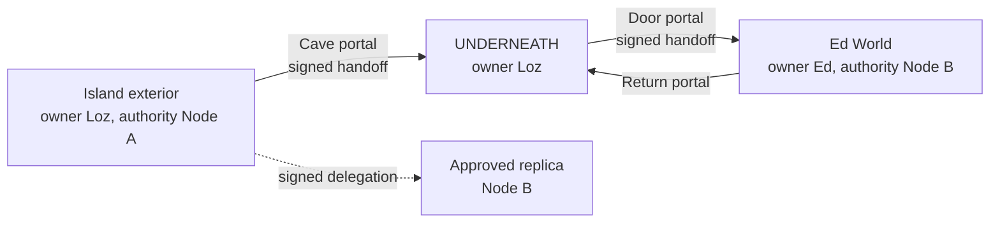

# Federated world protocol (experimental)

**The world is the protocol.** This document describes the first bounded protocol model in `network/federation.mjs`. It is a tested library and fixture set; a live cave-triggered authority transfer, remote Ed World renderer, and physical cross-node portal are not yet implemented.

The [provider-neutral networking plan](networking/architecture.md) is the current
forward design. It separates federation, connectivity and game transport, and
defines phased acceptance tests. The schemas described below are existing v1
foundations, not an implementation of that proposed ownership/admission protocol.

## Identity and authority

`PlayerID`, `NodeID`, `WorldID`, `RegionID`, `PortalID`, asset SHA-256 ID and `SessionID` have distinct prefixes. `NodeID` is the SHA-256 fingerprint of an Ed25519 public key. A route or IP address is never an identity. An `AuthorityID` for this version is the authority `NodeID` plus an epoch scoped to a `RegionID`; the epoch invalidates older handoffs. The transport directory resolves a region's current authority node to a current reachable endpoint. It is deliberately outside the manifest, so two peers can use overlapping `192.0.2.10/24` LANs without confusing region identity. A global directory is not required; direct invitations and trusted friend exchange are valid discovery paths. DHT/bootstrap/relay discovery remains future work.

Ownership (`ownerPlayerId`, `ownerNodeId`), administrators (`admins`), approved hosts (`hosts`), and live simulation authority (`authority.nodeId`, `authority.epoch`) are separate fields. The owner signs an immutable versioned manifest. A replica verifies that signature, the canonical manifest hash, a version-bound and expiring owner-signed host delegation, and every referenced asset hash. The prototype requires explicit host approval; it does not implement automatic election, revocation distribution, or global consensus. A trusted replica may have the same region bytes without becoming its owner. Revocation requires a newer manifest/version or an out-of-band trust update; live clients must not assume an old unexpired delegation has been revoked.

## Regions, portals and assets

`elsemesh.region/1` strictly validates a versioned descriptor with world ID, owner, hosts, authority, bounded rules, content-addressed assets, portal IDs, multiple player IDs and NPC IDs. A published pair `(RegionID, version, manifestHash)` is immutable; edits publish a new version. Assets may be hosted by multiple nodes; the hash defines identity, not location. The current implementation validates raw bytes and supported media types. Geometry and navigation data remain game assets, not arbitrary executable programs.

`elsemesh.portal/1` strictly validates source/destination region IDs, entry/exit transforms, visual type, enabled state, capability requirements, access rules, signed handoff policy and a monotonic revision. A cave, door or mirror is a visual choice, separate from the logical connection. `PortalGraph` lists, resolves, disables and retargets portals. An update must be signed by the current source authority, have the next revision and reference the previous destination. Dynamic retargeting is a controlled event, not random topology. Inter-owner invitations have a bounded expiry and require signatures from both region owners. A graph update alone is not the destination owner's consent; deployments must pair any new inter-owner destination with a valid invitation/acceptance. Revocation propagation is not yet implemented.

The existing Blender UNDERNEATH asset is `public/models/world/caves.glb`, with layout in `public/models/world/caves.json`. The fixture's cave portal uses its sea-level entrance near `(-340, 0, 80)` and leads to the existing interior. The browser currently renders that cave continuously in one scene. The fixture tests its logical connection, but gameplay does not yet call the signed handoff at that boundary. A future Blender exporter should write explicit `PortalID`, destination, visual type and transforms into object metadata, rather than infer `Cube.041` style names.

## Handoff and rules

The source authority signs `elsemesh.handoff/1` with player, session, portal ID/revision, source/destination regions, position, velocity, avatar and inventory hashes, control mode, source epoch, sequence and timestamp. The receiving authority verifies signature/trust, current source authority and epoch, portal identity/revision, bounded coordinates, age and one-time handoff ID before admission. The destination provides its rules and spawn transform; the client receives them through capability negotiation. Replay and expired handoffs fail. Frequent movement remains transient state; there is no per-frame consensus.

Rules are data, not machine permissions. The allowlist covers bounded gravity, avatar/environment scale, local/day/night presentation, weapon permission, and movement modes. A client must support all mandatory capabilities or entry fails cleanly. There is no remote script execution, arbitrary file access, Blender control or model endpoint access. Region availability has explicit states `ONLINE`, `REPLICA_AVAILABLE`, `DEGRADED`, `OFFLINE`, `UNREACHABLE`; unresolved portals fail rather than hang. Privacy-sensitive prompts are not part of public avatar state.

The fixtures include STANDARD exterior, NIGHT UNDERNEATH, SMALL WORLD (0.2 avatar scale), and ALTERED PHYSICS (0.35 gravity). Ed World has bounded reduced gravity and disallows weapons. The fixtures exercise negotiation without applying those physics to the current game renderer.

## Transport and control

Portal and region semantics are transport independent. Public Internet, LAN,
Tailscale and ZeroTier are connectivity choices; WebSocket, WebRTC and suitable
native QUIC/UDP libraries are transport choices. They are not interchangeable
game protocols. The reference TCP/UDP transport, native QUIC probe and local
browser demo are separate from the federation module. Their existence does not
verify provider or cross-transport interoperability. The reference transport is
currently **unencrypted** and is for controlled qualification, not an
internet-facing secure service.

Destination admission remains an explicit implementation gap: the current
`acceptPortalHandoff()` does not itself apply destination-owner access policy or
the portal player allowlist. A valid source signature or network membership must
not confer admission. The new plan requires a destination policy gate, and treats
initial portal travel as a new destination session. Inventory hashes in v1 are
not an atomic inventory transfer, and scripts/session continuity are separate work.

`HUMAN`, `AI_ASSISTED`, `AI_AUTONOMOUS` describe avatar controller mode. Switching mode preserves `PlayerID`; it does not create another avatar. The existing provider-independent `AgentInput` action adapter can feed the same player update path as human input. It has `walk_to`, `follow_player`, `look_at`, `stop`, jump and interact actions. Speech and a local model provider are not integrated. Public state may show controller mode, but not private instructions.

## Present boundary

The automated suite proves schema validation, region/portal graph operations, signatures, replay rejection, bounded rules, delegation, replica hashes, asset hashes and identity separation under overlapping subnet examples. A historical probe between two private machines physically exchanged a signed Ed World manifest, admitted a portal handoff and completed a return handoff. That is a **physical protocol proof only**. It did not move a rendered browser avatar, apply rules to the live game or transfer running simulation authority. The normal game remains playable without joining a federation. Planned next proof: browser cave entry triggers signed handoff; then an Ed-hosted minimal rendered region and return portal with live player input.
